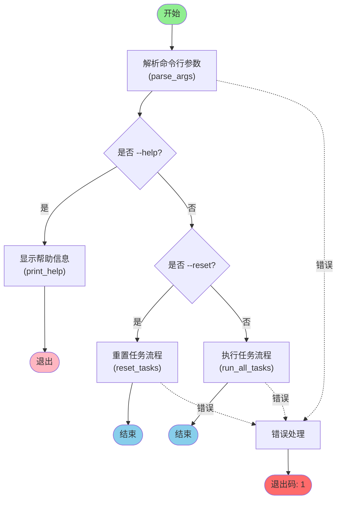
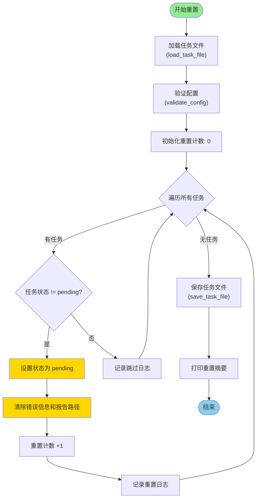
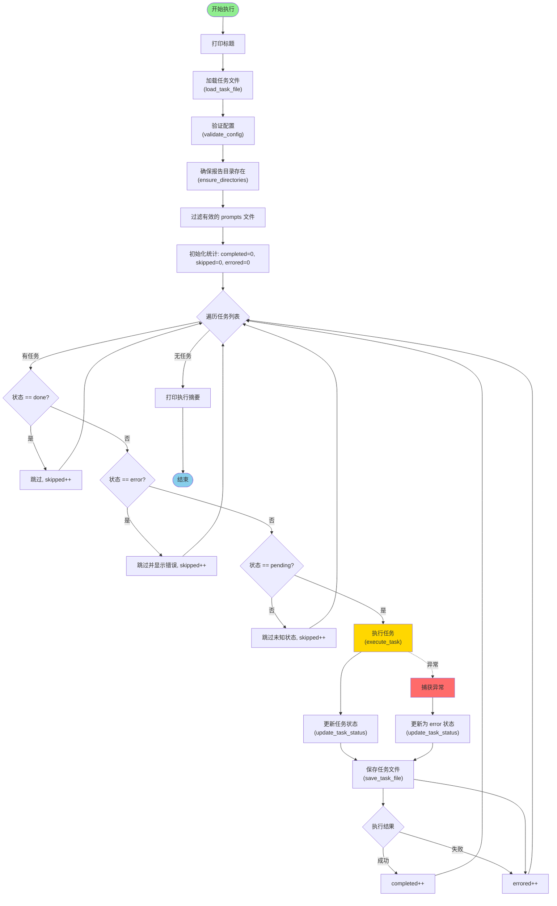
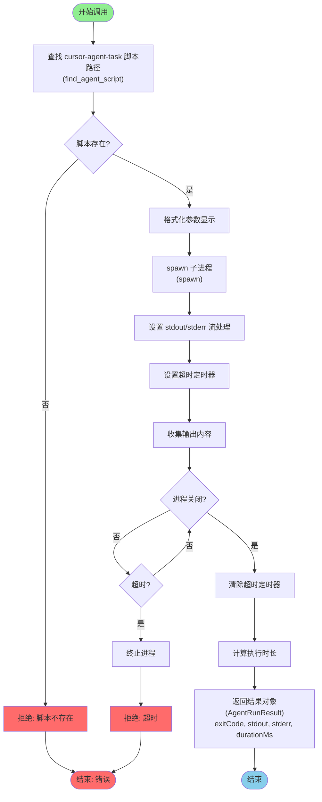
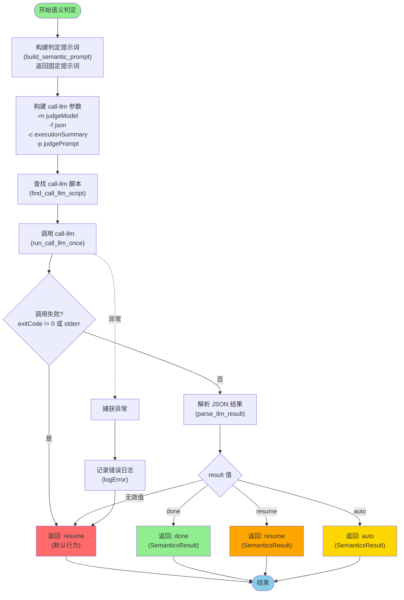
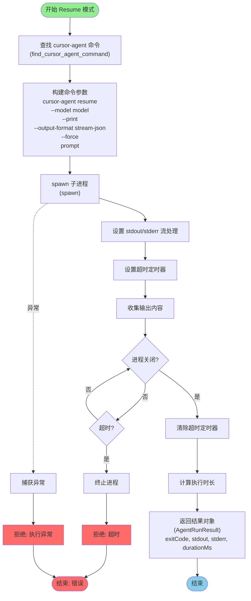
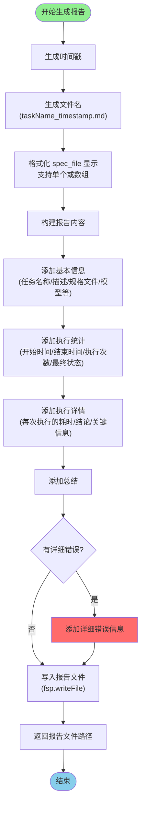
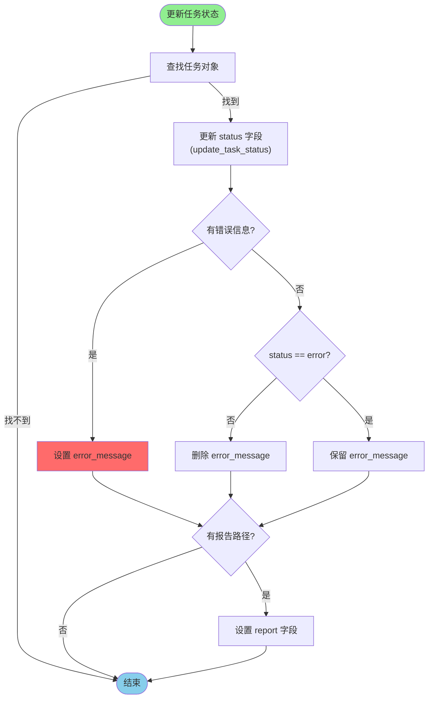
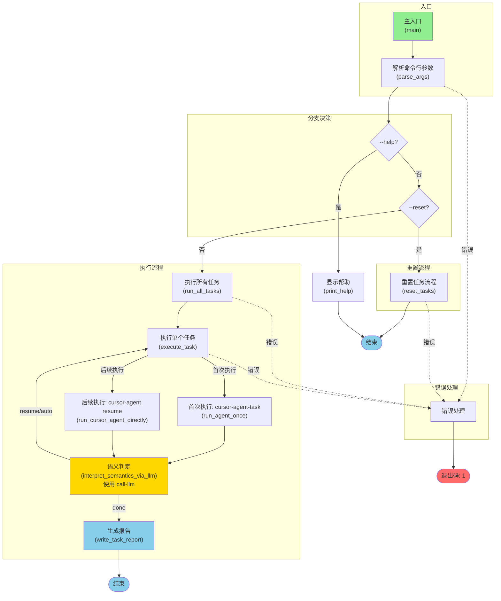

# cursor-tasks.js 流程图

本文档使用 Mermaid 图表展示 `cursor-tasks.js` 的执行流程。

## 主流程图



## 重置任务流程



## 执行所有任务流程



## 执行单个任务流程（核心流程）

```mermaid
flowchart TD
    Start([开始执行任务]) --> CheckSpec[检查 spec_file 是否存在]
    CheckSpec -->|不存在| ThrowError[抛出错误]
    ThrowError --> ErrorEnd([结束: 失败])
    
    CheckSpec -->|存在| CheckAgent["检查 cursor-agent-task 是否可用<br/>(find_agent_script)"]
    CheckAgent -->|不可用| ThrowError
    
    CheckAgent -->|可用| InitVars[初始化变量<br/>needsContinue=true<br/>attempts=0<br/>lastSemanticsResult=null]
    InitVars --> BuildInitialArgs["构建首次执行参数<br/>(build_agent_args)<br/>-m model<br/>-f prompts<br/>-f spec_file"]
    BuildInitialArgs --> LoopStart{是否继续 且 attempts < retry?}
    
    LoopStart -->|是| IncAttempts[attempts++]
    IncAttempts --> CheckAttempt{attempts == 1?}
    
    CheckAttempt -->|是| RunAgent["首次执行: 使用 cursor-agent-task<br/>(run_agent_once)"]
    CheckAttempt -->|否| CheckSemantics{上次判定结果 == auto?}
    CheckSemantics -->|是| SetResumePrompt[设置 resumePrompt = "按你的建议执行"]
    CheckSemantics -->|否| SetResumePrompt[设置 resumePrompt = "请继续"]
    SetResumePrompt --> RunResume["后续执行: 使用 cursor-agent resume<br/>(run_cursor_agent_directly)"]
    RunResume --> RunAgent
    
    RunAgent --> CheckRuntime["运行时错误?<br/>(is_runtime_error)"]
    
    CheckRuntime -->|是| SetError["记录错误信息<br/>(extract_short_error_message)"]
    SetError --> BreakLoop[跳出循环]
    
    CheckRuntime -->|否| CallLLM["调用 call-llm 进行语义判定<br/>(interpret_semantics_via_llm)"]
    CallLLM --> ParseResult[解析 JSON 结果<br/>(parse_llm_result)<br/>result: done/resume/auto]
    ParseResult --> SaveSemantics[保存判定结果到 lastSemanticsResult]
    SaveSemantics --> CheckResult{判定结果}
    
    CheckResult -->|done| SetSuccess[标记为成功<br/>needsContinue=false]
    SetSuccess --> BreakLoop
    
    CheckResult -->|resume/auto| LogContinue[记录继续原因]
    LogContinue --> RecordExecution[记录本次执行]
    RecordExecution --> LoopStart
    
    BreakLoop --> CheckMaxRetry{attempts >= retry<br/>且 needsContinue?}
    CheckMaxRetry -->|是| SetPartial[标记为部分完成]
    CheckMaxRetry -->|否| SetFinalStatus[设置最终状态]
    SetPartial --> SetFinalStatus
    
    SetFinalStatus --> GenerateReport["生成任务报告<br/>(write_task_report)"]
    GenerateReport --> WriteReport[写入报告文件]
    WriteReport --> ReturnResult[返回执行结果]
    ReturnResult --> End([结束])
    
    RunAgent -.->|异常| CatchRunError[捕获执行异常]
    CatchRunError --> SetError
    
    style Start fill:#90EE90
    style End fill:#87CEEB
    style RunAgent fill:#FFD700
    style SetSuccess fill:#90EE90
    style SetError fill:#FF6B6B
    style SetPartial fill:#FFA500
```

## Agent 调用流程



## 语义判定流程（使用 call-llm）



## Resume 模式执行流程



## 报告生成流程



## 任务状态更新流程



## 完整执行流程图（概览）



## 关键数据结构

### 任务对象 (Task)
```typescript
interface Task {
  name: string;              // 任务名称
  description?: string;      // 任务描述
  spec_file: string | string[];  // 规格文件路径（单个或数组）
  status: "pending" | "done" | "error";  // 任务状态
  error_message?: string;    // 错误信息（简短）
  report?: string;          // 报告文件路径
}
```

### 全局配置 (GlobalConfig)
```typescript
interface GlobalConfig {
  taskFile: string;          // 任务文件路径
  model: string;            // 模型名称
  retry: number;            // 重试次数
  timeoutMinutes: number;   // 超时时间（分钟）
  reportDir: string;        // 报告目录
  reset: boolean;           // 是否重置
  help: boolean;           // 是否显示帮助
}
```

### Agent 执行结果 (AgentRunResult)
```typescript
interface AgentRunResult {
  exitCode: number;         // 退出码
  stdout: string;          // 标准输出
  stderr: string;          // 标准错误
  durationMs: number;      // 执行时长（毫秒）
}
```

### 语义判定结果 (SemanticsResult)
```typescript
interface SemanticsResult {
  needsContinue: boolean;   // 是否需要继续
  reasons: string[];        // 原因列表
  acceptanceSummary: string; // 验收摘要
}
```

### 执行结果 (ExecutionResult)
```typescript
interface ExecutionResult {
  status: "error" | "done"; // 最终状态
  error_message?: string;    // 简短错误信息
  detailedError?: string;    // 详细错误信息
  reportPath: string;       // 报告文件路径
  attempts: number;          // 执行次数
}
```

## 关键函数说明

| 函数名 | 功能描述 |
|--------|---------|
| `parse_args` | 解析命令行参数，返回全局配置对象 |
| `load_task_file` | 读取并解析 task.json 文件 |
| `validate_config` | 校验配置完整性（任务名称唯一性、必需字段等） |
| `find_agent_script` | 查找 cursor-agent-task 脚本路径 |
| `build_agent_args` | 构建 agent 调用的参数数组 |
| `run_agent_once` | 执行一次 agent 调用，返回执行结果 |
| `is_runtime_error` | 判定是否为运行时错误 |
| `extract_acceptance_criteria` | 从 spec 文件中提取验收相关的内容 |
| `build_semantic_prompt` | 生成语义判定提示 |
| `interpret_semantics_via_agent` | 通过 agent 进行语义判定 |
| `write_task_report` | 生成任务执行报告 |
| `update_task_status` | 更新任务状态 |
| `save_task_file` | 原子性保存 task.json |
| `reset_tasks` | 重置所有任务状态为 pending |
| `execute_task` | 执行单个任务（包含重试和语义判定循环） |
| `run_all_tasks` | 执行所有任务 |

## 流程说明

### 主要特点

1. **状态驱动**: 任务执行基于状态（pending/done/error），只执行 pending 状态的任务
2. **重试机制**: 每个任务最多重试 `retry` 次
3. **语义判定**: 每次执行后通过 AI 判定任务是否完成，未完成则继续执行
4. **原子性保存**: 使用临时文件 + 重命名确保 task.json 写入的原子性
5. **实时输出**: Agent 执行过程中的输出实时显示到控制台
6. **详细报告**: 每次任务执行都会生成详细的 Markdown 报告

### 执行策略

- **跳过已完成**: 状态为 `done` 的任务直接跳过
- **跳过错误**: 状态为 `error` 的任务跳过（避免重复执行失败任务）
- **继续执行**: 通过语义判定判断任务是否完成，未完成则继续下一次执行
- **部分完成**: 达到重试上限仍未完成时，标记为"部分完成"

### 错误处理

- 运行时错误：检测退出码和非零 stderr
- 超时处理：设置超时定时器，超时后终止进程
- 异常捕获：所有关键步骤都有 try-catch 保护
- 错误记录：错误信息保存到 task.json 和详细报告中

